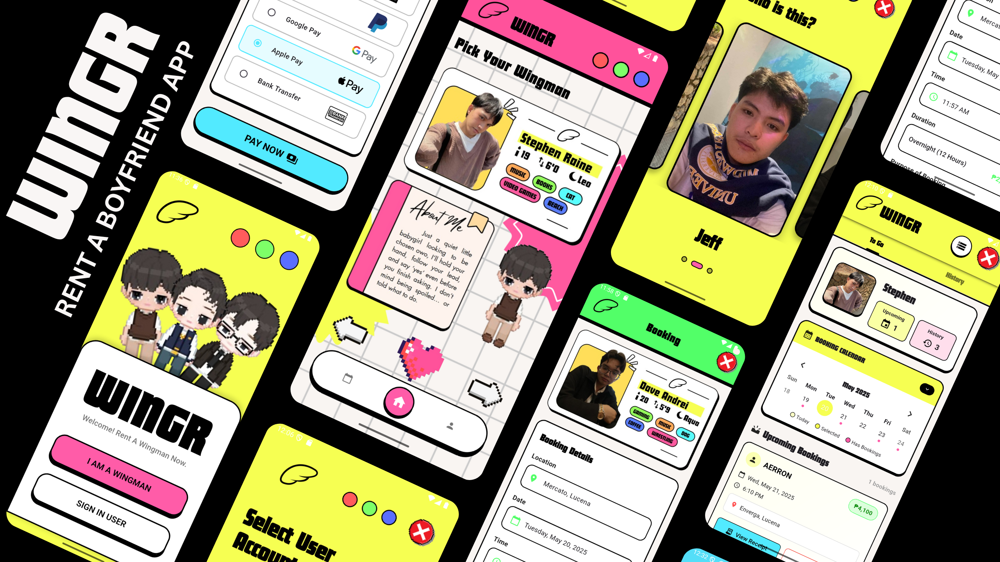

# WINGR - Rent A Wingman

## Overview

Wingr is a transaction-based mobile application that allows users to rent a wingman/boyfriend for various social occasions. The app provides a seamless booking experience, secure payment processing, and profile management for both users and wingmen.

## Key Features

### For Users
- **Wingman Selection**: Browse through profiles of available wingmen with detailed information
- **Booking System**: Select dates, times, and durations that fit your schedule
- **Purpose Selection**: Choose from multiple booking purposes including movie dates, family events, shopping companions, and more
- **Payment Processing**: Secure transaction system with multiple payment methods
- **Booking Management**: View, track, and cancel active bookings
- **Digital Receipts**: Access detailed receipts for all transactions

### For Wingmen
- **Personal Dashboard**: View upcoming bookings and schedule
- **Booking Calendar**: Calendar view of all appointments with visual indicators
- **Financial Tracking**: Monitor earnings and completed bookings
- **Booking Management**: Accept, complete, or cancel bookings with client notification
- **Performance Metrics**: Track history and statistics on the service dashboard

## User Journey

The app guides users through a streamlined process:
1. Select a wingman from available profiles
2. Choose booking details (date, time, duration, and purpose)
3. Complete payment through preferred payment method
4. Receive digital receipt and booking confirmation
5. Manage active bookings through the bookings page

## Technical Implementation

Built with Flutter, the app features:
- Responsive UI design with consistent branding
- Persistent storage for user data and booking information
- Interactive components with smooth animations
- Multi-tab navigation system
- Real-time notification system between users and wingmen

## Getting Started with Development

This project is built using Flutter. To run the development environment:

1. Ensure Flutter is installed on your machine
2. Clone the repository
3. Run `flutter pub get` to install dependencies
4. Run `flutter run` to start the app on your connected device or emulator

For help getting started with Flutter development, view the
[online documentation](https://docs.flutter.dev/), which offers tutorials,
samples, guidance on mobile development, and a full API reference.
